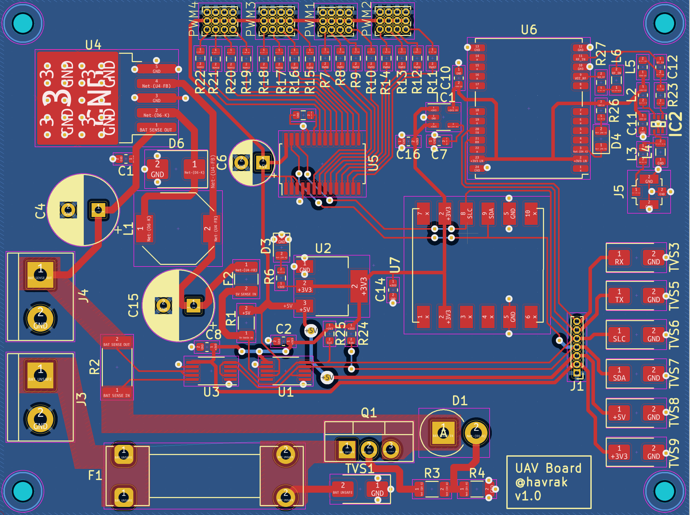

# UAV project

This repository contains all resource that comprised my final thesis for my senior year in high school.
Main purpose was to create UAV platform based on Raspberry Pi.

Codebase is this project is rather bad by my current standards and is heavily impacted by the fact it was essentially my first hardware related project.
Not to mention my experience with C++ was rather limited at the time.

Desktop client is written in C++ using Gtk3 and is used to control the drone and display telemetry data.
UI wise it's really bad, and code itself doesn't land much in a way for easy rewrite.

Drone side might fare a bit better, but it's still not great.
Usage of threads is rather questionable and OOP design patterns were a hip new thing for me at the time and not something I was able to use properly.

Thus some parts of codebase are overengineered and some lack any flexibility and don't deserve much other than deletion.

In my 3rd semester of university I've made addition to this project in a shape of proper custom PCB to house drone electronics.

I might rewrite this project in the future, but time is a limited resource and school+work take priority.
Though if rewrite happens, it will be wholly different project.
* camera streaming with gstreamer has never worked as well as I wanted it to
* using Wi-Fi for communication was never ideal (drone was acting as AP)
* codebase and communication protocol needs to be much more open to allow different configurations of hardware
* desktop client needs to be rewritten from scratch and preferably in Qt
* way more robust compilation and deployment process is needed (Kconfig, hierarchical Makefiles, etc.)

# Libraries and toolkits
* [WT901B library](https://github.com/havrak/Raspberry-JY901-Serial-I2C)
* [INA226 library](https://github.com/havrak/raspberry-pi-ina226)
* [PCA9685 library](https://github.com/havrak/PCA9685-rpi)
* [inih (INI Not Invented Here)](https://github.com/benhoyt/inih)
* Gtk3
* crp, fmt
* WiringPi

# Photos

### UAV Photos

### Board

# Credits
* textures for desktop client originate from [marek-cel/QFlightinstruments](https://github.com/marek-cel/QFlightinstruments)

