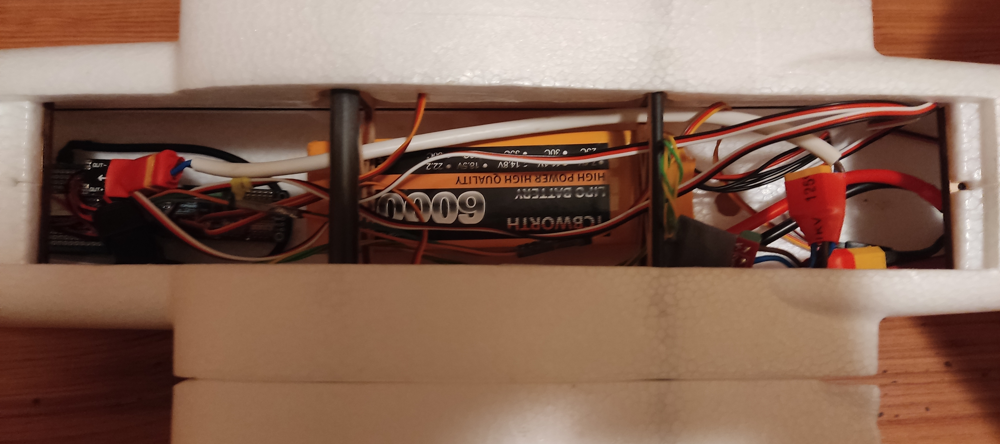
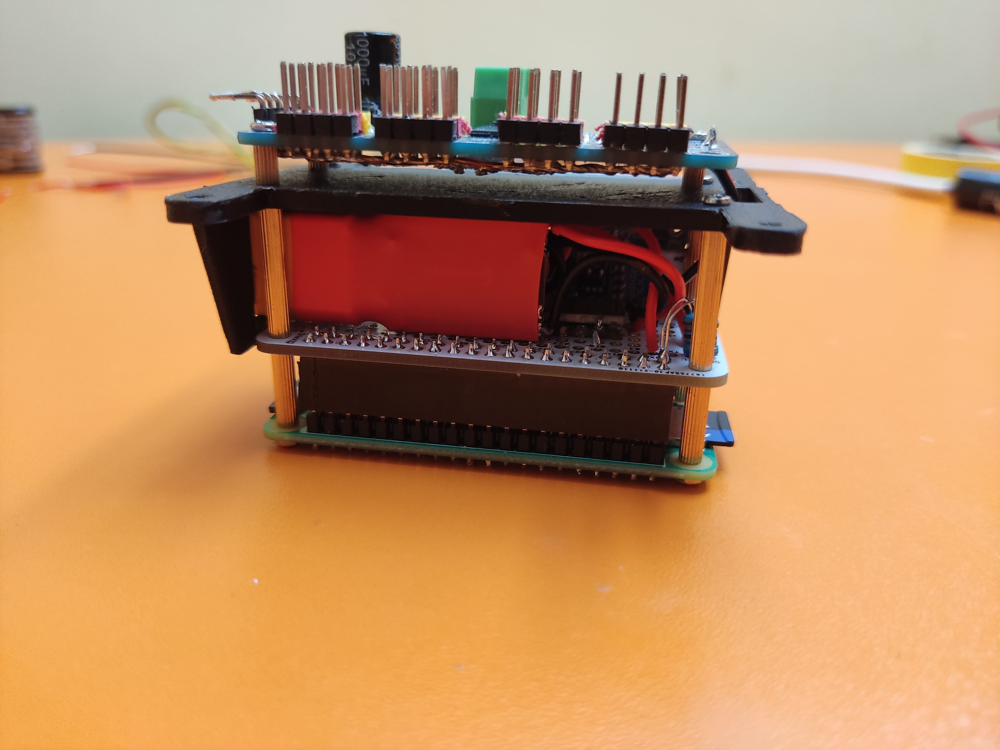
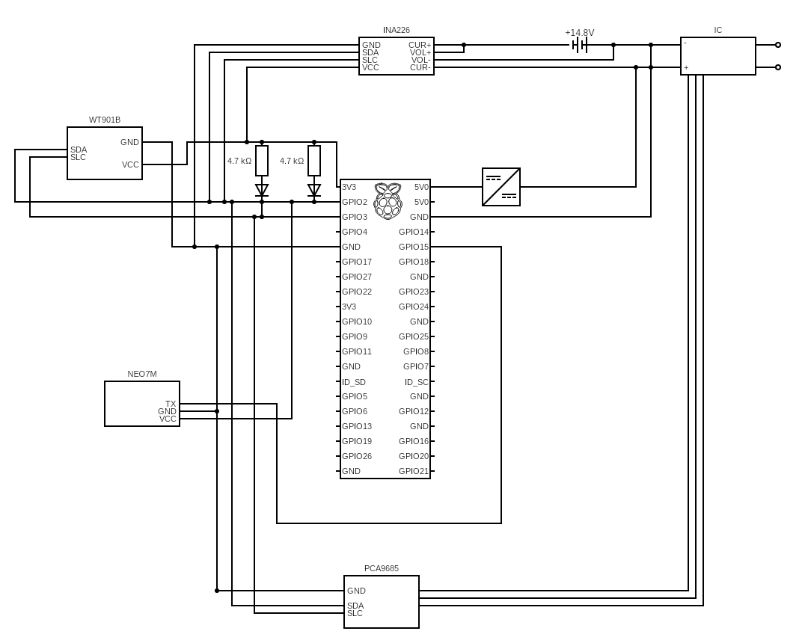

# UAV project

This is project for my (hopefully) final year of highschool.

Main purpose is to create UAV platform based on Raspberry Pi.
However as I have never done anything like this I'm not sure how far will I get.

Alongside code for the drone and software to control it this repo includes various stl files to be 3d printed.

# Components

| Component                                     | Description                                        |
|-----------------------------------------------|----------------------------------------------------|
| X-UAV Mini Talon (PNP)                        | Basic chassis of the UAV                           |
| 1200kv motor 					                        | Main motor of the drone                            |
| Beatles 40A ESC                               | Electronic speed control                           |
| 4 servo motor                                 | Servos to control all control surfaces             |
| ublox NEO-7M                                  | GPS module                                         |
| PCA9685                                       | 16 Channel driver for servos                       |
| Wifi Adapter                                  | 6Dbi Wi-Fi adapter to extend range of rpi0 Wi-Fi   |
| Raspberry Pi Zero 2                           | Main computing unit of the UAV                     |
| DC-DC 24V 12V 9V to 5V (does not have a name) | Step down convertor to lower battery's 14,8V to 5V |
| INA226                                        | Volt/Ampere meter to measure draw from the battery |
| WitMotion WT901B                              | Acc, Gyro, Angle, Mag and Barometer                |
| Pi Camera (chinese knock-off)                 | camera for rpi0 to get video from the drone        |
| Prototype Board for Raspberry Pi Zero         | mounts all components                             |

* Rpi0 2 is not strictly necessary for plane to work, my original zero just broke, so I had to buy a new one
* whole drone runs off from 4S 14.8V battery with XT60 plug, thus packet of XT60 F/M plugs is also necessary
* servos and Pi have seperete supply of power thus two step down converters and XT60 splitter
* On PC side I'm using Alfa Wi-Fi adapter with 25dBi directional antenna

# Libraries and toolkits
* [WT901B library](https://github.com/havrak/Raspberry-JY901-Serial-I2C)
* [INA226 library](https://github.com/havrak/raspberry-pi-ina226)
* [PCA9685 library](https://github.com/havrak/PCA9685-rpi)
* [inih (INI Not Invented Here)](https://github.com/benhoyt/inih)
* OpenCV
* Gtk3
* crp
* WiringPi (used by some libraries above) -- need to move to gpio library

# Photos

### UAV Photos

### Controlling unit

### Circuit schema

# Credits
* textures for desktop client originate from [marek-cel/QFlightinstruments](https://github.com/marek-cel/QFlightinstruments)

